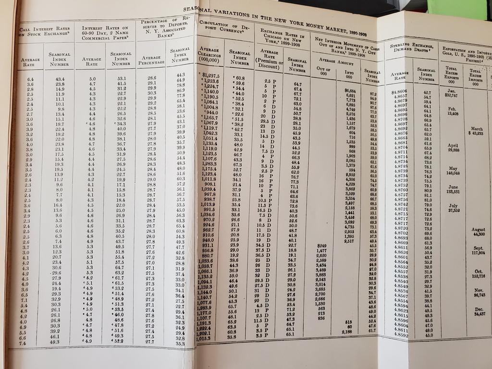
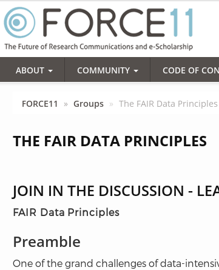
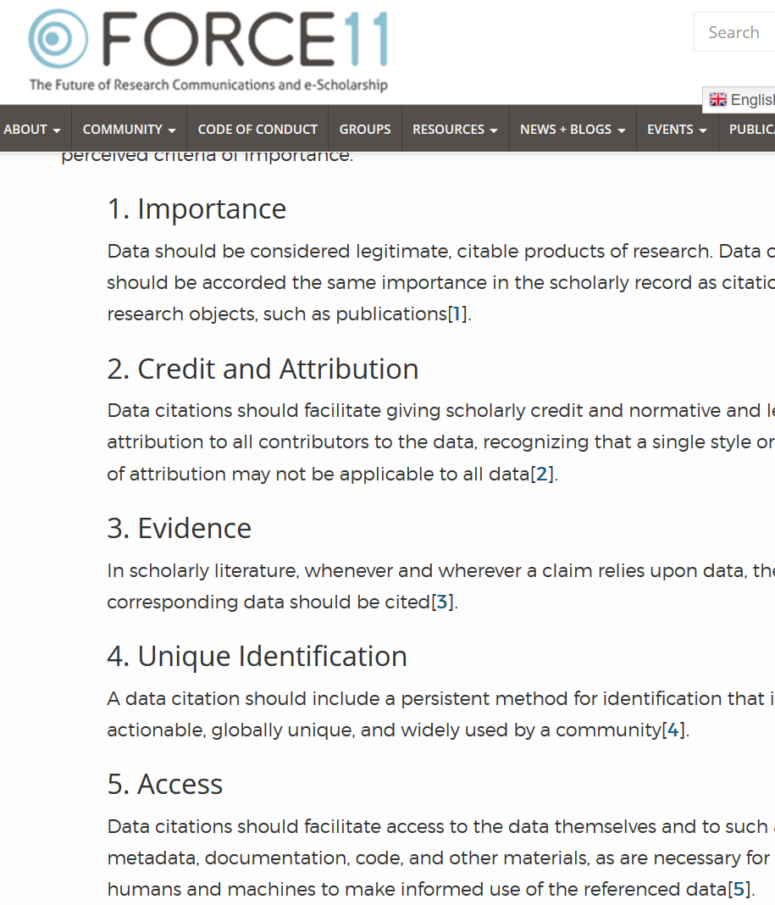

# Best practices? {background-image="images/lake-steaming.jpg" background-size="contain" background-position="bottom"}

# First: why? {background-image="images/lake-red.jpg" background-size="contain" background-position="bottom"}

## Why reproducibility?

::: {.incremental}
- Credibility
- Transparency (openness)
- Efficiency of scholarly discourse?
:::

## Why reproducibility?

:::: {.columns}

::: {.column width="50%"}

- Early publications (20th century) contained tables of data, and the math was simple (maybe)
- Data became electronic, was no longer included or cited
- Math was transcribed to code, and was no longer included

:::

::: {.column width="50%"}

:::
::::

## Increasing broad consensus in academia

::: {.incremental}
- FAIR principles
- Data Citation Principles
- Computational Reproducibility 
:::

## FAIR Principles

::::{.columns}

:::{.column width="50%"}

FAIR:

- **F**indable
- **A**ccessible
- **I**nteroperable
- **R**eusable

:::

:::{.column width="50%"}

:::

::::

## Data Citation Principles

::::{.columns}

:::{.column width="50%"}

:::

:::{.column width="50%"}

To make it **findable**,

[^dc]

[^dc]:  Data Citation Synthesis Group: Joint Declaration of Data Citation
Principles. Martone M. (ed.) San Diego CA: FORCE11; 2014
<https://www.force11.org/group/joint-declaration-data-citation-principles-final>

:::

::::

