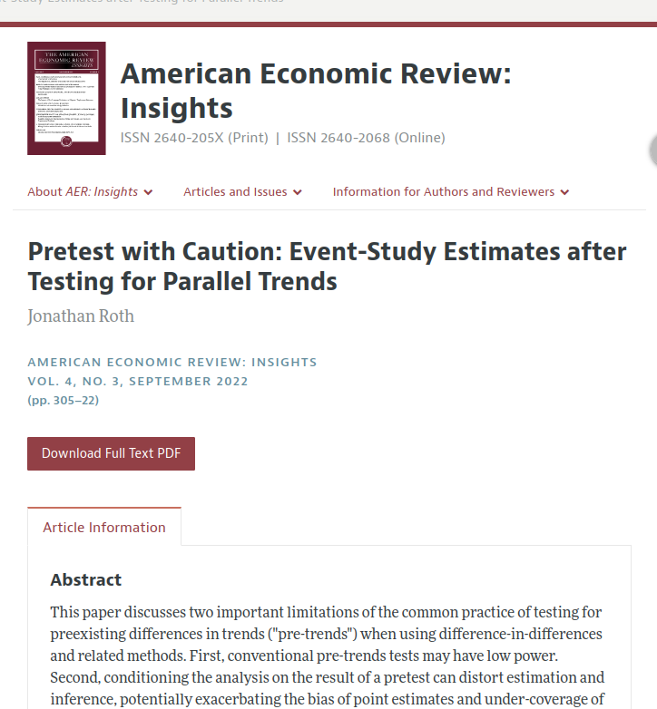
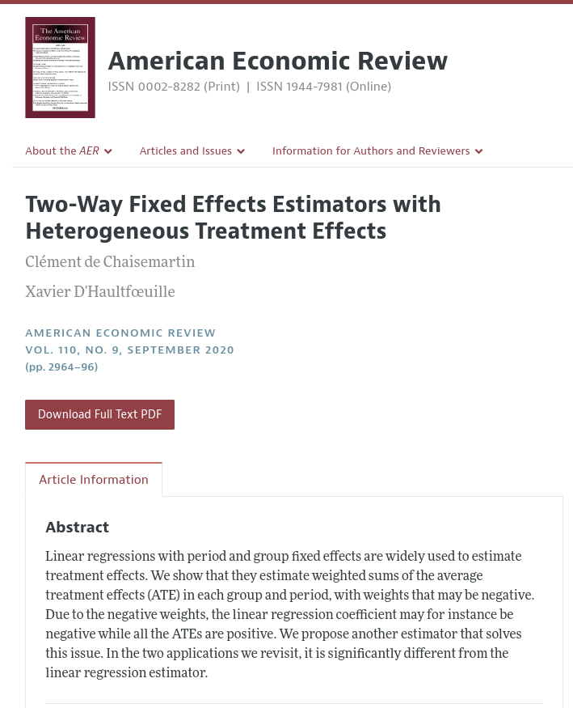

# Benefits

## Building on the work of others

:::: {.columns}

::: {.column width="60%"}

Roth, Jonathan. 2022. "Pretest with Caution: Event-Study Estimates after Testing for Parallel Trends." American Economic Review: Insights 4 (3): 305–22. DOI: [10.1257/aeri.20210236](https://doi.org/10.1257/aeri.20210236)

Notes: "*I exclude 43 papers for which data to replicate the main event-study plot were unavailable.*"

:::

::: {.column width="40%"}

:::
::::

## Building on the work of others: dCdH 2020

:::: {.columns}

::: {.column width="60%"}

de Chaisemartin, Clément, and Xavier D'Haultfœuille. 2020. "Two-Way Fixed Effects Estimators with Heterogeneous Treatment Effects." American Economic Review 110 (9): 2964–96. DOI: [10.1257/aer.20181169](https://doi.org/10.1257/aer.20181169)

The results from various other papers are  recomputed to empirically demonstrate the relevance of the proposed methods.

:::

::: {.column width="40%"}

:::

::::

