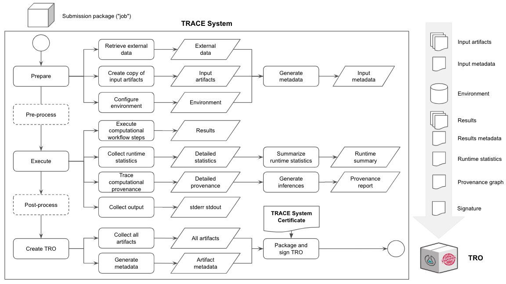

# Transparency elsewhere

## Transparency outsourced

- [Talk to Limor!](https://dissc.yale.edu/people/limor-peer)
- [Cornell's R-squared](https://socialsciences.cornell.edu/research-support/R-squared)
- [cascad](https://www.cascad.tech/)
- [World Bank](https://doi.org/10.1162/99608f92.21328ce3)

## Transparency outsourced

- A third party conducts the reproducibility, not you, not me.
- Need to common understanding, protocols, etc.
- [AEA's protocol](https://www.aeaweb.org/journals/data/policy-third-party)
- We do this about a dozen times per year

## Transparency outsourced

Why should I believe the third party?

- Trust
- Transparency
- Common methods

## Transparency certified

## Transparency certified

- Providing information about the computing platforms themselves, including specific details about how computational transparency is supported.
- Packaging and signing resulting artifacts along with records of their execution using a standard format.

## Applications

- Limor, R-squared, cascad, World Bank!
- FSRDC? IRS? 
- Meta data?

